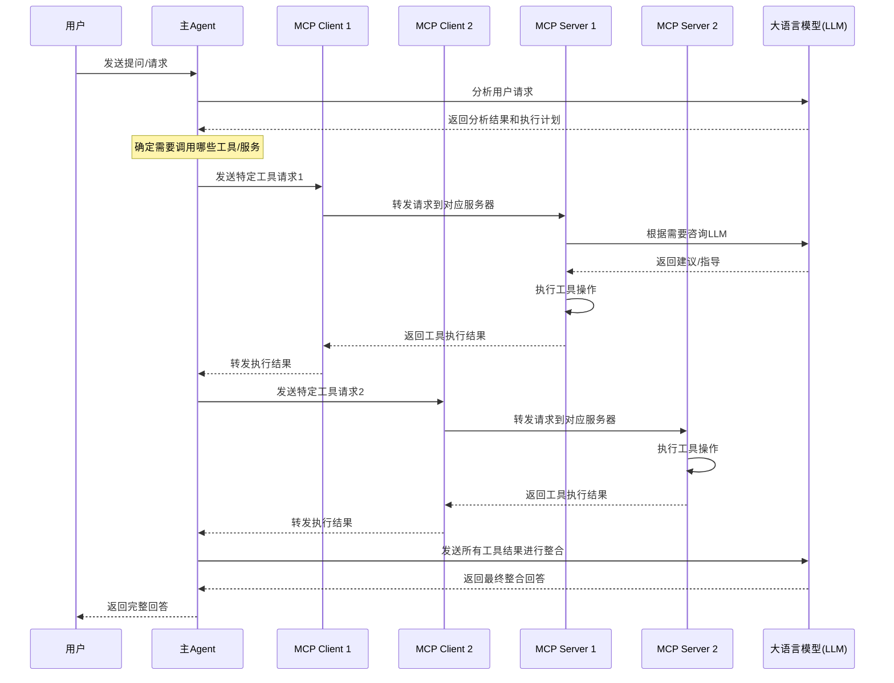

##### 1.  如果我开发一个agent ，需要对接多个mcp server， 那么我的agent 需要一个mcp client 还是多个mcp client，他们的关系是什么样的？
 
Model Context Protocol (MCP)是一个旨在为AI模型提供统一接口的协议标准，它允许AI模型或agent与各种外部工具、系统和服务进行交互。

关于您的问题：

如果您的agent需要对接多个MCP服务器，您有两种主要的架构选择：

1. **单一MCP客户端**：
    
    - 您可以实现一个中央MCP客户端，负责与所有MCP服务器的通信
    - 这个客户端会管理所有连接，并根据需要将请求路由到适当的服务器
    - 优点：管理简单，代码集中，资源共享
    - 缺点：如果一个连接出现问题，可能影响所有服务器交互
2. **多个MCP客户端**：
    
    - 为每个MCP服务器创建一个专用的客户端实例
    - 每个客户端负责与特定服务器的通信
    - 优点：更好的隔离性，一个连接的问题不会影响其他连接
    - 缺点：需要更多的管理，可能导致资源使用增加

MCP客户端与您的agent之间的关系通常是：

- MCP客户端作为您agent的一个组件或服务
- Agent通过客户端发送请求到MCP服务器，并接收响应
- 客户端处理底层通信细节，如连接管理、序列化/反序列化、错误处理等

最佳实践通常是根据您的具体需求采用混合方法：创建一个MCP客户端管理层，它可以根据需要实例化和管理与不同服务器的连接，同时为您的agent提供一个统一的接口。

这样，您的agent不需要关心底层是使用一个还是多个客户端，它只需要通过统一的接口请求特定的功能即可。

##### 2.  如果是多个mcp client 对应多个mcp agent ，那么我使用agent的一次提问，agent，mcp client，mcp server 以及 大模型LLM，之间的调用关系是什么样的，如果可以画出调用图

您需要了解在多MCP客户端和服务器架构中的调用关系，我可以为您绘制一个图表来说明这个过程。

在这个架构中，调用关系如下：

1. **用户发起请求**：用户向主Agent发送一个问题或请求。
    
2. **主Agent处理请求**：
    
    - Agent先将用户请求发送给LLM进行分析
    - LLM帮助Agent理解用户需求并制定执行计划
    - Agent决定需要调用哪些特定工具或服务来完成请求
3. **多MCP客户端调用**：
    
    - 对于每个需要的功能，Agent会调用对应的MCP客户端
    - 每个MCP客户端负责与特定的MCP服务器通信
    - MCP客户端将请求格式化并发送到对应的MCP服务器
4. **MCP服务器处理**：
    
    - MCP服务器接收到请求后执行对应的工具或服务
    - 某些MCP服务器可能需要咨询LLM来完成特定任务
    - 服务器完成操作后将结果返回给对应的MCP客户端
5. **结果整合与返回**：
    
    - 各MCP客户端将结果返回给主Agent
    - Agent可能会再次调用LLM，将所有工具执行结果整合成连贯的回答
    - 最终整合的回答返回给用户

这种设计的优势在于：

- 每个MCP客户端和服务器对专注于特定功能
- 服务之间解耦，便于维护和扩展
- 可以同时调用多个工具以并行处理复杂任务

不同MCP服务器可以专注于不同的功能领域，如检索信息、执行计算、访问API等，从而让整个系统更加模块化和灵活。

##### 3. 其中  "某些MCP服务器可能需要咨询LLM来完成特定任务", 是mcp server 主动发起请求咨询llm吗还是需要通过agent，请举个例子

是的，在MCP架构中，MCP服务器可以直接与LLM通信，无需通过主Agent中转。这是MCP设计的一个重要特点，允许各个工具服务器在需要时独立调用LLM能力。

让我举一个具体例子来说明：

假设您有一个文档分析工具，作为一个MCP服务器实现：

1. 用户向主Agent发送请求："分析我的季度财务报告并提取关键指标"
    
2. 主Agent决定需要使用文档分析工具，于是通过MCP客户端向文档分析MCP服务器发送请求
    
3. 文档分析MCP服务器收到请求后：
    
    - 首先处理并解析文档
    - 确定需要提取哪些财务指标
    - **直接调用LLM**："根据这份财务报告，提取营收、利润率、运营成本和增长率等关键指标"
    - LLM分析文本并返回提取的指标
    - 文档分析服务器整理这些指标，可能进行额外的格式化或验证
    - 将最终结果返回给对应的MCP客户端，然后传回主Agent

这种直接调用的好处是：

1. **效率**：服务器可以直接与LLM通信，减少通信延迟
2. **专业性**：服务器可以使用针对其特定任务优化的提示词，不需要主Agent了解每个工具的细节
3. **灵活性**：服务器可以根据处理过程中发现的新信息动态调整与LLM的交互
4. **资源利用**：减轻主Agent的处理负担，分散系统负载

在实际应用中，可能会有各种不同的MCP服务器直接调用LLM的场景，例如：

- 代码分析工具需要LLM解释复杂代码段
- 数据可视化工具需要LLM帮助选择最佳图表类型
- 语言翻译工具需要LLM进行上下文感知的翻译
- 内容审核工具需要LLM评估内容的适当性

这种架构使整个系统更加模块化和可扩展，每个服务器可以专注于自己的专业领域，同时在需要时利用LLM的能力。